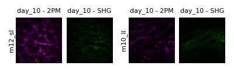

# Radon Transform Analysis of Blood Vessel and Collagen Interactions

## Overview

This project uses the **Radon Transform algorithm** to evaluate the interaction between newly forming blood vessels and collagen bundles in a fracture gap at **day 7, 10, and 14** post-operation. The study is described in the **ICBSP paper**.  

The analysis is performed on **co-registered images** of fluorescently labeled blood vessels and second-harmonic generation (SHG) images of collagen bundles. The code computes alignment ratios, generates scatter plots, boxplots, and co-alignment grids to visualize the relationship between vessels and collagen over time.

In this study, we analyzed two experimental groups of mice:  
- **LL group**  
- **SL group** 
---

## Folder Structure

The code expects the following folder structure:
<pre> ```
01_data/
├─ 2PM/
│ ├─ m07_sl/
│ │ ├─ day_07/
│ │ │ └─ img.tif
│ │ ├─ day_10/
│ │ │ └─ img.tif
│ │ └─ day_14/
│ │ └─ img.tif
│ ├─ m08_sl/
│ │ ├─ day_07/
│ │ │ └─ img.tif
│ │ ├─ day_10/
│ │ │ └─ img.tif
│ │ └─ day_14/
│ │ └─ img.tif
│ └─ ...
├─ SHG/
│ ├─ m07_sl/
│ │ ├─ day_07/
│ │ │ └─ img.tif
│ │ ├─ day_10/
│ │ │ └─ img.tif
│ │ └─ day_14/
│ │ └─ img.tif
│ ├─ m08_sl/
│ │ ├─ day_07/
│ │ │ └─ img.tif
│ │ ├─ day_10/
│ │ │ └─ img.tif
│ │ └─ day_14/
│ │ └─ img.tif
│ └─ ...│
``` </pre>

### Notes:

- `2PM/` contains fluorescent blood vessel images.  
- `SHG/` contains collagen bundle SHG images.  
- Each mouse has a separate folder (`m07_sl`, `m08_sl`, …).  
- Inside each mouse folder, images are organized by day (`day_07`, `day_10`, `day_14`).  
- All image files are expected to be `.tif` format.  
- The same folder structure will be created for the output


## Usage

This section explains how to run the Radon Transform analysis and visualize the results.

---

### 1. Set Up Arguments

The analysis is controlled via an `argparse.Namespace` object. Here’s an example of how to configure it:

```python
import argparse

args = argparse.Namespace(
    mode="radon",                      # Run the Radon Transform analysis
    input_folder="01_data",             # Path to the folder containing your data
    result_folder="01_outputs/01_radon_output_00",  # Folder where results will be saved
    display_mode="count_points",        # Display mode for plotting
    coregistered_channels=["2PM", "SHG"],  # Channels present in the data
    visualize_channel=["2PM", "SHG"],      # Channels to visualize
    groups=['ll', 'sl'],               # Mouse groups to include
    mouse=None,                        # Specific mouse (None = all mice)
    day=None,                          # Specific day (None = all days)
    color=True,                        # Enable colored plotting
    lines=False,                        # Connect points with lines if True
    patch_size=100,                     # Patch size for Radon analysis (adjustable)
    patch_step=100,                     # Patch step for Radon analysis (adjustable)
    sigma=1.0,                          # Gaussian smoothing parameter (adjustable)
    normalize=True,                     # Normalize results if True
    save=True                           # Save results to the specified folder
)

```
- mode must be "radon" to execute the analysis.

- Adjust patch_size, patch_step, and sigma according to your data resolution.

- Setting save=True writes all plots and computed metrics to the result_folder.

### 2. Run the Analysis

```python

python main_01.py

```
This will process all images in input_folder, and save results in 01_outputs

### 3. Visualize Results

After running the analysis, the results can be explored using the **visualization mode**.  
To enable this, set:

- `mode="display"` – switch from computation to visualization.  
- `save=True` – save all generated plots to the `result_folder`.  

The visualization provides different perspectives on the data, depending on the chosen `display_mode`. Each mode highlights a specific aspect of the results, ranging from raw point counts to alignment ratios and co-alignment grids across groups and channels.


---

#### Available Display Modes

The parameter `display_mode` controls how the results are shown.  
Here’s a brief overview of the available options:

- **`"images"`**

  Displays all images used in the analysis. This mode is useful for visually inspecting the raw input data.  
  The following parameters can be configured:  

  - `visualize_channel=["2PM", "SHG"]` – choose whether to display blood vessels (2PM), collagen (SHG), or both.  
  - `groups=['ll', 'sl']` – specify which experimental group(s) to display.  
  - `mouse=None` – select a specific mouse within a group (if `None`, all mice are shown).  
  - `day=None` – select a specific time point (if `None`, all available days are shown).  
  - `color=True` – if `True`, blood vessels are shown in **magenta** and collagen in **green**; if `False`, images are shown in grayscale.  
  - `lines=False` – if `True`, the detected orientations will be overlaid on top of each image.  

  - 

- **`"count_points"`**  
  Displays scatter plots of the number of extracted points per mouse and day, with mean values shown as lines.  

- **`"ratios"`**  
  Shows boxplots and scatter plots of alignment ratios (numerator/denominator of selected bins), color-coded per mouse.  

- **`"co_alignment"`**  
  Creates co-alignment grid plots that compare alignment ratios across days and channels. Useful for group-level comparisons.  

- **`"alignment_grid"`**  
  Generates a structured grid of subplots (days × channels × groups) to visualize alignment differences in detail.  

---