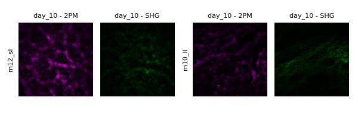
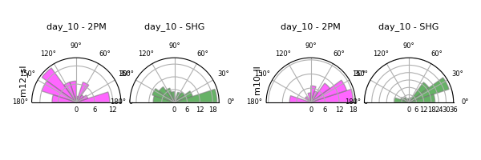
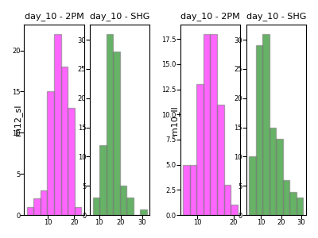
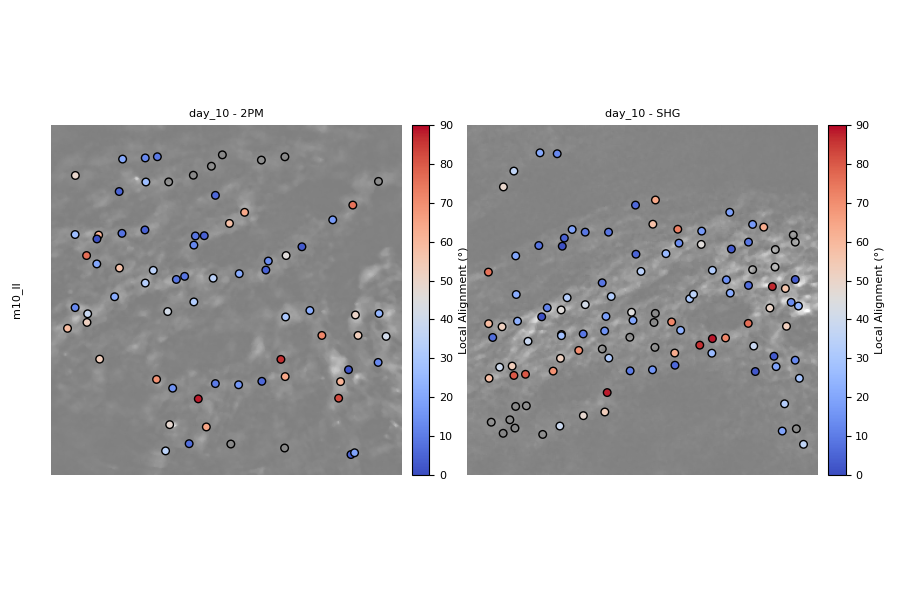
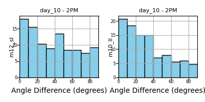
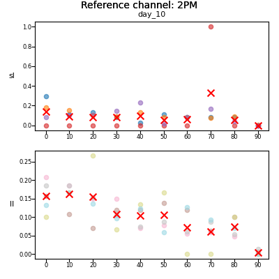
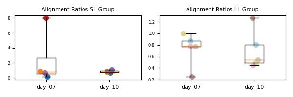
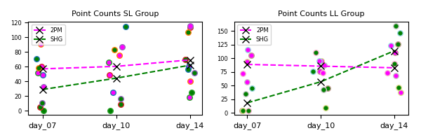

# Radon Transform Analysis of Blood Vessel and Collagen Interactions

## Overview

This project uses the **Radon Transform algorithm** to evaluate the interaction between newly forming blood vessels and collagen bundles in a fracture gap at **day 7, 10, and 14** post-operation. The study is described in the **ICBSP paper**.  

The analysis is performed on **co-registered images** of fluorescently labeled blood vessels and second-harmonic generation (SHG) images of collagen bundles. The code computes alignment ratios, generates scatter plots, boxplots, and co-alignment grids to visualize the relationship between vessels and collagen over time.

In this study, we analyzed two experimental groups of mice:  
- **LL group**  
- **SL group** 
---

## Folder Structure

The code expects the following folder structure:
<pre> ```
01_data/
├─ 2PM/
│ ├─ m07_sl/
│ │ ├─ day_07/
│ │ │ └─ img.tif
│ │ ├─ day_10/
│ │ │ └─ img.tif
│ │ └─ day_14/
│ │ └─ img.tif
│ ├─ m08_sl/
│ │ ├─ day_07/
│ │ │ └─ img.tif
│ │ ├─ day_10/
│ │ │ └─ img.tif
│ │ └─ day_14/
│ │ └─ img.tif
│ └─ ...
├─ SHG/
│ ├─ m07_sl/
│ │ ├─ day_07/
│ │ │ └─ img.tif
│ │ ├─ day_10/
│ │ │ └─ img.tif
│ │ └─ day_14/
│ │ └─ img.tif
│ ├─ m08_sl/
│ │ ├─ day_07/
│ │ │ └─ img.tif
│ │ ├─ day_10/
│ │ │ └─ img.tif
│ │ └─ day_14/
│ │ └─ img.tif
│ └─ ...│
``` </pre>

### Notes:

- `2PM/` contains fluorescent blood vessel images.  
- `SHG/` contains collagen bundle SHG images.  
- Each mouse has a separate folder (`m07_sl`, `m08_sl`, …).  
- Inside each mouse folder, images are organized by day (`day_07`, `day_10`, `day_14`).  
- All image files are expected to be `.tif` format.  
- The same folder structure will be created for the output


## Usage

This section explains how to run the Radon Transform analysis and visualize the results.

---

### 1. Set Up Arguments

The analysis is controlled via an `argparse.Namespace` object. Here’s an example of how to configure it:

```python
import argparse

args = argparse.Namespace(
    mode="radon",                      # Run the Radon Transform analysis
    input_folder="01_data",             # Path to the folder containing your data
    result_folder="01_outputs/01_radon_output_00",  # Folder where results will be saved
    display_mode="count_points",        # Display mode for plotting
    coregistered_channels=["2PM", "SHG"],  # Channels present in the data
    visualize_channel=["2PM", "SHG"],      # Channels to visualize
    groups=['ll', 'sl'],               # Mouse groups to include
    mouse=None,                        # Specific mouse (None = all mice)
    day=None,                          # Specific day (None = all days)
    color=True,                        # Enable colored plotting
    lines=False,                        # Connect points with lines if True
    patch_size=100,                     # Patch size for Radon analysis (adjustable)
    patch_step=100,                     # Patch step for Radon analysis (adjustable)
    sigma=1.0,                          # Gaussian smoothing parameter (adjustable)
    normalize=True,                     # Normalize results if True
    save=True                           # Save results to the specified folder
)

```
- mode must be "radon" to execute the analysis.

- Adjust patch_size, patch_step, and sigma according to your data resolution.

- Setting save=True writes all plots and computed metrics to the result_folder.

### 2. Run the Analysis

```python

python main_01.py

```
This will process all images in input_folder, and save results in 01_outputs

### 3. Visualize Results

After running the analysis, the results can be explored using the **visualization mode**.  
To enable this, set:

- `mode="display"` – switch from computation to visualization.  
- `save=True` – save all generated plots to the `result_folder`.  

The visualization provides different perspectives on the data, depending on the chosen `display_mode`. Each mode highlights a specific aspect of the results, ranging from raw point counts to alignment ratios and co-alignment grids across groups and channels.


---

#### Available Display Modes

The parameter `display_mode` controls how the results are shown.  
Here’s a brief overview of the available options:

- **`"images"`**

  Displays all images used in the analysis. This mode is useful for visually inspecting the raw input data.  
  The following parameters can be configured:  

  - `visualize_channel=["2PM", "SHG"]` – choose whether to display blood vessels (2PM), collagen (SHG), or both.  
  - `groups=['ll', 'sl']` – specify which experimental group(s) to display.  
  - `mouse=['m12_sl', 'm10_ll']` – select a specific mouse within a group (if `None`, all mice are shown).  
  - `day=['day_10']` – select a specific time point (if `None`, all available days are shown).  
  - `color=True` – if `True`, blood vessels are shown in **magenta** and collagen in **green**; if `False`, images are shown in grayscale.  
  - `lines=False` – if `True`, the detected orientations will be overlaid on top of each image.  

  <p align="center">
    
  </p>

- **`"polar_histogram"`**  
   Displays the polar histogram of the detected angles. Computes the polar histograms of the detected angles.
This mode is useful for quantifying and visualizing the orientation distribution of collagen fibers or vessels.
The following parameters can be configured:

  - `visualize_channel=["2PM", "SHG"]` – choose whether to compute histograms for blood vessels (2PM), collagen (SHG), or both.
  - `groups=['ll', 'sl']` – specify which experimental group(s) to include in the analysis.
  - `mouse=['m12_sl', 'm10_ll']` – select a specific mouse within a group (if None, all mice are included).
  - `day=['day_10']` – select a specific time point (if None, all available days are included).
  - `color=True` – if True, histograms are color-coded (magenta for blood vessels, green for collagen); if False, histograms are displayed in grayscale.

  <p align="center">
    
  </p>

- **`"widths"`**  
  Displays the histogram of the detected widths. This mode is useful for quantifying and visualizing the distribution of the widths.
  The same parameters as above can be configured:

  - `visualize_channel=["2PM", "SHG"]`
  - `groups=['ll', 'sl']` 
  - `mouse=['m12_sl', 'm10_ll']` 
  - `day=['day_10']` 
  - `color=True`
  
    <p align="center">
      
    </p>
  
- **`"local_alignment"`**
  Displays the local alignment between two structures from result dictionaries.
This mode is useful for assessing the spatial relationship between blood vessels (2PM) and collagen (SHG).
For each detected point in the reference image (e.g. 2PM), the function checks whether a nearby point exists in the co-registered SHG image. If so, the local alignment is displayed as a color-coded point:

  - **blue** – structures are aligned
  - **red** – structures are perpendicular

  The results are shown directly on the image for intuitive visualization.
  It uses the same parameters as above:

  - `visualize_channel=["2PM", "SHG"]`
  - `groups=['ll']` 
  - `mouse=['m10_ll']` 
  - `day=['day_10']` 

    <p align="center">
      
    </p>
  
- **`"angle_differences"`**  
  Displays the histogram of angle differences between two channels for a given mouse and day.
  This mode compares the orientations of structures detected in one channel with those detected in the co-registered channel.
  The histogram ranges from 0° to 90°, indicating how many points within a given radius are aligned (close to 0°) or perpendicular (close to 90°).

    - `visualize_channel=["2PM", "SHG"]` - the channel specified in visualize_channel is used as the reference. If multiple channels are provided, the function iterates over all inputs, using each channel once as the reference.
  The channel specified in coregistered_channels is used as the comparison.
    - The target channel(s) are the channels in **`coregistered_channels`** that are not listed in visualize_channel (i.e. the other channel(s)).
      - Example: if **`visualize_channel=["2PM"]`** and **`coregistered_channels=["2PM","SHG"]`**, the target will be ["SHG"].

      <p align="center">
        
      </p>
  
- **`"mean_angle_differences"`**
  Displays the histogram of angle differences across all mice for a given day.
This mode extends the single-mouse angle difference analysis to all mice, allowing for easy comparison of distributions.

  - Each mouse’s value at a given histogram bin is displayed as a dot.
  - The same color is used for the same mouse across all bins.
  - The mean value across mice for each bin is displayed as a red cross.

  Angle differences are computed the same way as in the single-mouse function (0°–90° range, reference vs. target channels).
  Following parameters can be configured:
  
  - `visualize_channel=["2PM", "SHG"]`
  - `groups=['ll', 'sl']` 
  - `day=['day_10']` 

    <p align="center">
        
    </p>
  
- **`"angular_co_alignment"`**  
  Displays the alignment ratio from angle difference histograms for each mouse.
  This mode quantifies the degree of alignment by comparing the number of points in the low-angle bins to those in the high-angle bins.

  - The first few bins (e.g., 0°–30°) are summed to form the denominator, representing aligned points.
  - The last few bins (e.g., 50°–90°) are summed to form the numerator, representing perpendicular points.
  - The alignment ratio is calculated as numerator / denominator for each mouse.

  The results are visualized as:
  - A scatter plot where each mouse is represented by a single color.
  - A boxplot overlay showing the distribution across mice.
  
  Following parameters can be configured: 
  - `visualize_channel=["2PM"]` - takes one argument in this function: the channel to be used as a reference.
  - `groups=['ll', 'sl']` 
  - `day=['day_10']` 
  
    <p align="center">
        
    </p>
  
- **`"count_points"`**  
  Displays scatter plots of the number of extracted points per mouse and day, with mean values shown as lines.  
  - Each point represents a single mouse at a given day.
  - Mean values across mice are indicated by connecting lines.
  - The point color/contour identifies the individual mouse
  
  Following parameters can be configured: 
  - `visualize_channel=["2PM", "SHG]` 
  - `groups=['ll', 'sl']` 
  - `day=None` 

  <p align="center">
        
  </p>

---